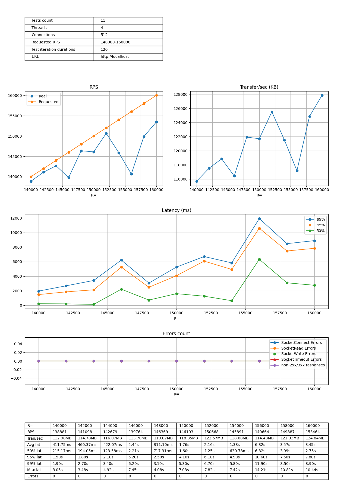
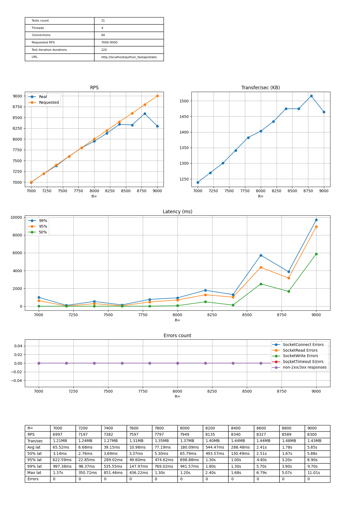
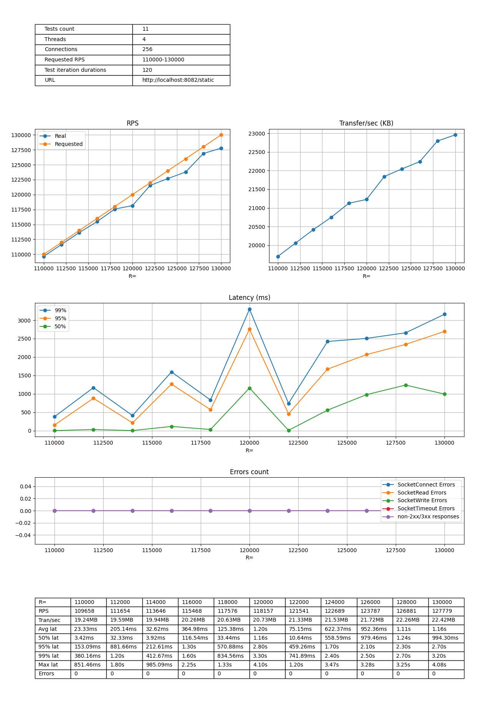
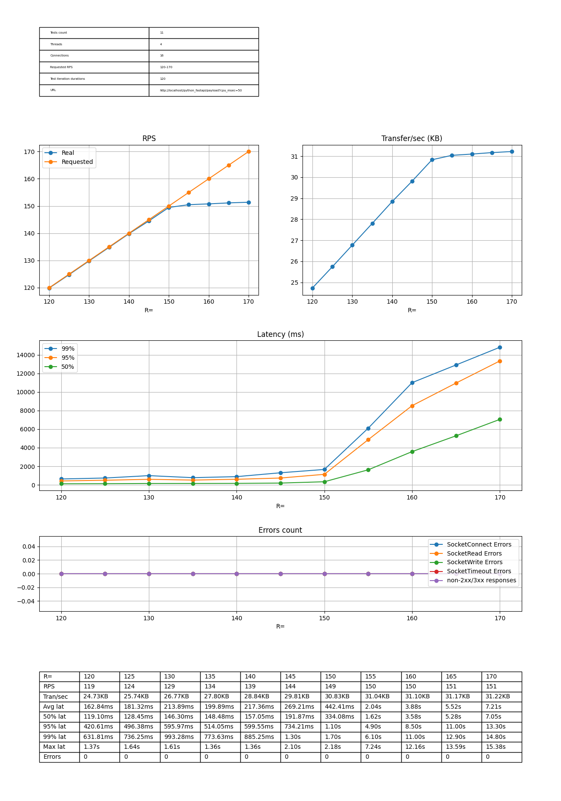
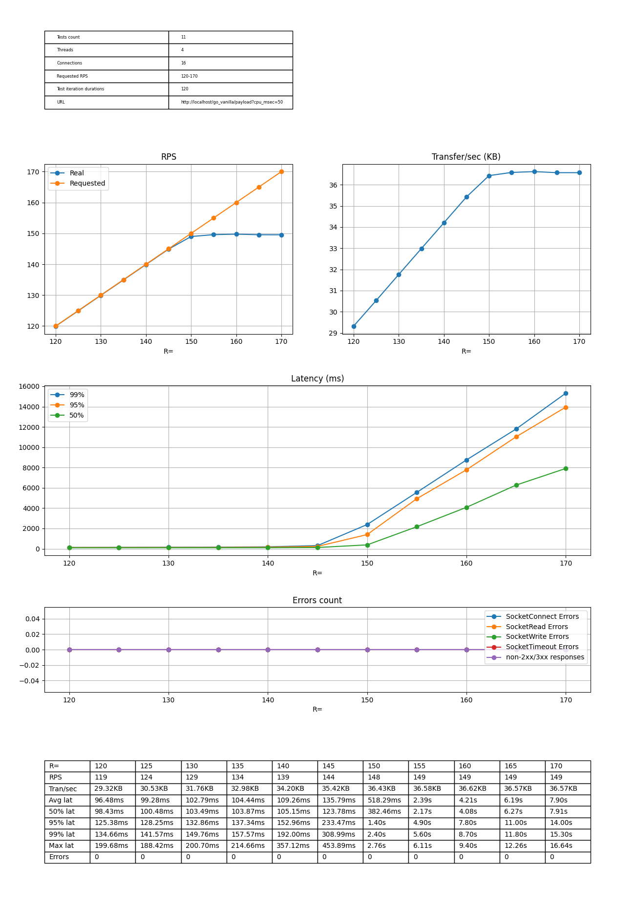

# Задание 4

Latency-throughput диаграммы

## Статика

## Nginx

## Python (fastapi)

## Go (vanilla net/http)

**Примечание:** без nginx forward-proxy

## Нагрузка cpu 50ms

## Python (fastapi)

## Go (vanilla net/http)

