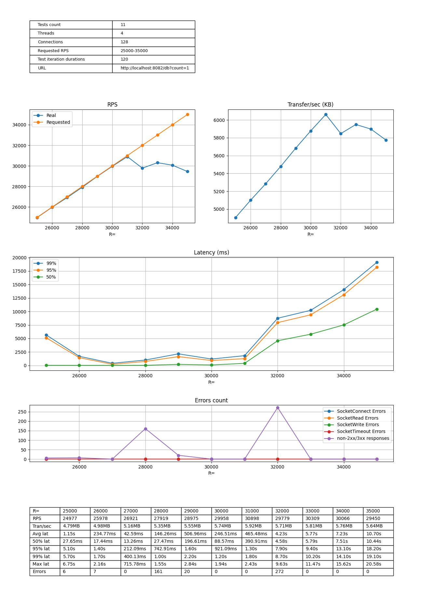
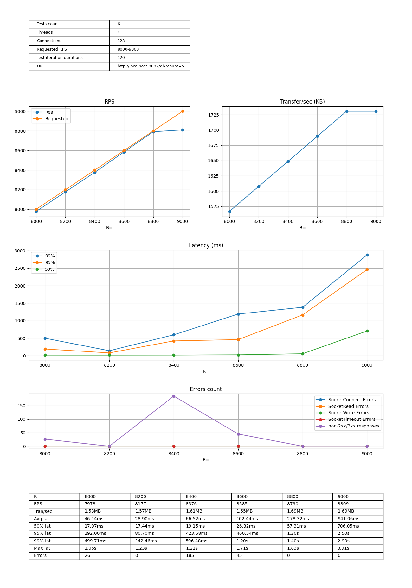
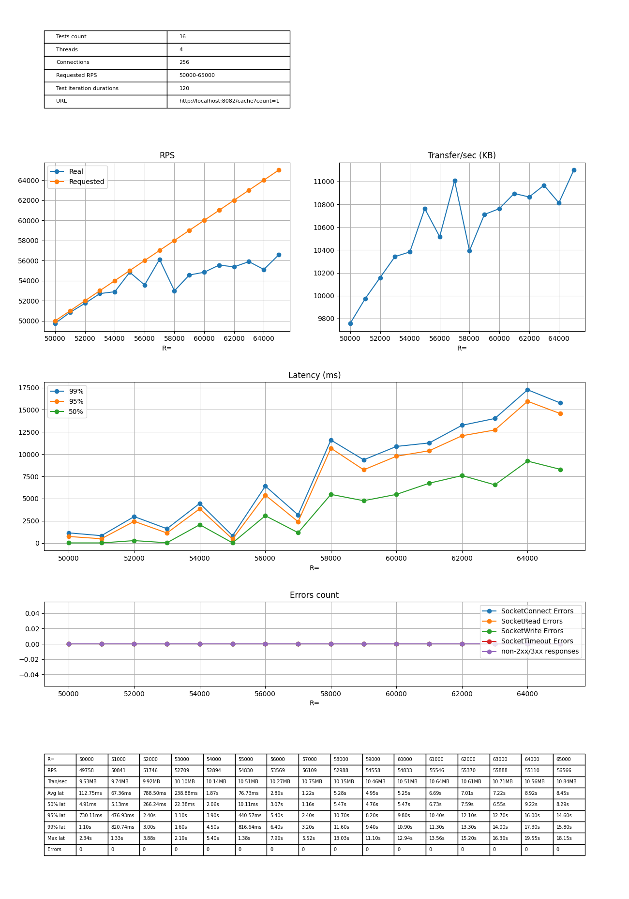
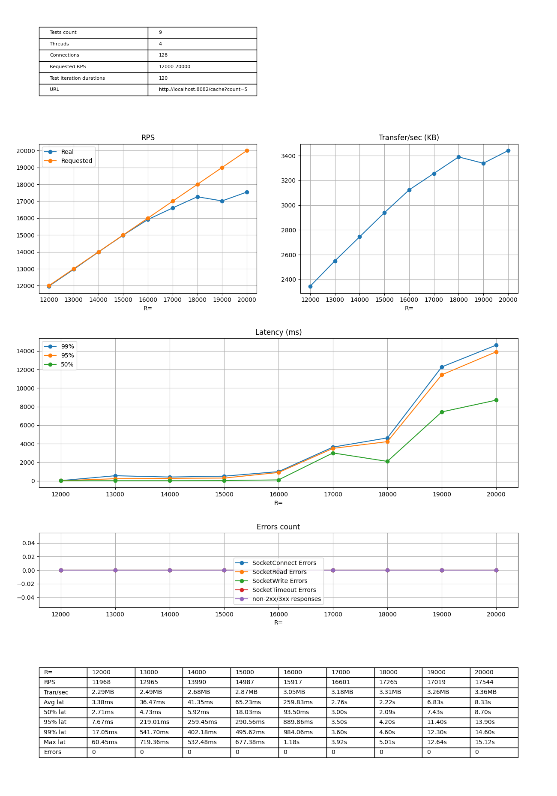

# Задание 5

Latency-throughput диаграммы субд/кэш

## Go (vanilla net/http)

**Примечание:** без nginx forward-proxy

### 1 запрос к СУБД

### 5 запросов к СУБД

### 1 запрос к кэшу

### 5 запросов к кэшу

